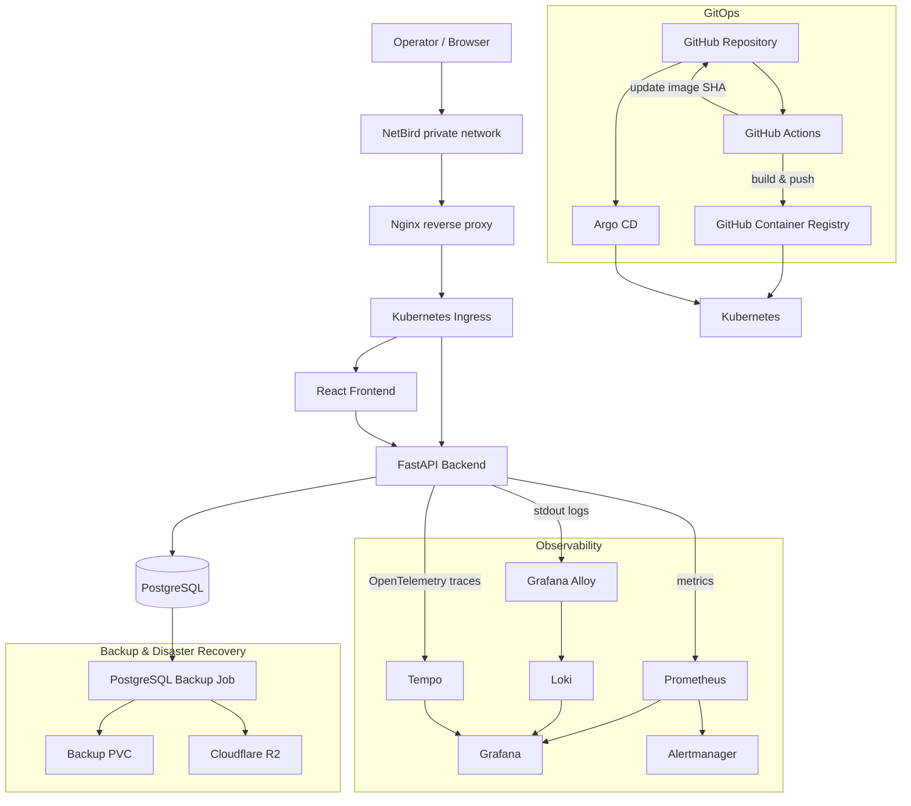

# Cloud Operations Center

> A cloud-native operations platform for service monitoring, incident management, observability and infrastructure automation.


**Cloud Operations Center** is a hands-on Cloud / DevOps / SRE project designed to reproduce the core operational workflows used to run modern applications on Kubernetes.

It combines application development, GitOps, observability, automated health checking, incident management, CI/CD and disaster recovery in a single platform.

The goal is not only to deploy an application, but to operate it.

---

## Overview

Cloud Operations Center provides a web interface for monitoring services and managing incidents while running on a Kubernetes-based infrastructure with a complete observability stack.

The platform includes:

* Service registration and health monitoring
* Automated service checks
* Incident creation and lifecycle management
* Operational dashboard
* Prometheus metrics
* Centralized logs with Loki
* Distributed tracing with OpenTelemetry and Tempo
* Grafana operational dashboards
* Prometheus / Alertmanager alerting
* GitOps deployment with Argo CD
* CI/CD with GitHub Actions
* Container images stored in GitHub Container Registry
* Horizontal Pod Autoscaling
* PostgreSQL persistence
* Automated PostgreSQL backups
* Off-site backup replication to Cloudflare R2
* Tested database restore / disaster recovery
* Secure remote access through NetBird

---

## Architecture



---

## Core Features

### Operational dashboard

The React frontend provides a centralized view of the platform:

* Total registered services
* Healthy services
* Unavailable services
* Open incidents
* Platform operational status
* Last refresh timestamp
* Manual refresh controls

The frontend periodically refreshes operational data from the FastAPI backend.

---

### Service monitoring

Services can be registered and monitored from the platform.

The service checker periodically evaluates registered services and records their availability.

This provides the data required for:

* Current service status
* Availability history
* Operational dashboards
* Incident detection
* Metrics and alerting

---

### Incident management

The platform includes an incident lifecycle for operational events.

Incidents can move through states such as:

* Open
* Investigating
* Resolved

This allows the project to model workflows commonly found in operations and SRE teams.

---

## Observability

Observability is built around the three main signals: **metrics, logs and traces**.

### Metrics — Prometheus

The FastAPI backend exposes Prometheus metrics including application and HTTP telemetry.

Examples include:

* Request count
* Request rate
* HTTP status codes
* Request latency
* Process CPU
* Process memory
* Business-level operational metrics

Prometheus also monitors Kubernetes workloads and alerting rules.

---

### Logs — Grafana Alloy + Loki

Application logs are written to stdout and collected from Kubernetes workloads.

```text
FastAPI
   ↓
structured application logs
   ↓
Grafana Alloy
   ↓
Loki
   ↓
Grafana
```

Logs can be correlated with application activity and HTTP failures from Grafana.

---

### Traces — OpenTelemetry + Tempo

The FastAPI backend is instrumented with OpenTelemetry.

```text
Request
   ↓
FastAPI
   ↓
OpenTelemetry
   ↓
Tempo
   ↓
Grafana
```

Trace and span identifiers are also included in application request logging, making it possible to correlate requests with distributed traces.

---

### Grafana

Grafana provides operational dashboards for both infrastructure and application behavior.

Current dashboards include:

* **Cloud Operations Center**
* **Cloud Operations Center — Backend Observability**

They expose information such as:

* Backend availability
* PostgreSQL availability
* HTTP traffic
* Error rates
* Request latency
* Container restarts
* Kubernetes replicas
* Active alerts
* Backend logs

---

## Alerting

Prometheus evaluates alerting rules and forwards alerts to Alertmanager.

The repository also contains automation workflows designed to process technical alerts and incident state changes.

This separates responsibilities between:

* Detection
* Alert routing
* Operational automation
* Incident management

---

## Kubernetes

The application runs on Kubernetes and is divided into dedicated namespaces.

### `cloud-ops`

Contains the application workloads:

* Frontend
* Backend
* PostgreSQL
* Service checker
* Database migrations
* Backup jobs

### `monitoring`

Contains the observability platform:

* Prometheus
* Grafana
* Loki
* Tempo
* Grafana Alloy
* Alertmanager

Additional platform components are managed through Argo CD.

---

## GitOps with Argo CD

Argo CD continuously reconciles the desired state stored in Git with the Kubernetes cluster.

The project uses several Argo CD applications to separate responsibilities, including:

* Application workloads
* Monitoring
* Loki
* Grafana Alloy
* cert-manager

The main applications use automated synchronization and pruning so that Kubernetes converges toward the state defined in the repository.

```text
Git
 ↓
Argo CD
 ↓
Kubernetes
```

This makes Git the source of truth for infrastructure and application deployment.

---

## CI/CD

GitHub Actions provides the delivery pipeline.

For every relevant change:

1. Backend Python code is validated.
2. Frontend dependencies are installed.
3. Frontend linting is executed.
4. The frontend production build is validated.
5. Backend and frontend Docker images are built.
6. Images are pushed to GitHub Container Registry.
7. Images receive immutable `sha-<commit>` tags.
8. Kubernetes manifests are automatically updated with the new image SHA.
9. The GitOps change is committed back to the repository.
10. Argo CD detects the new desired state and deploys it.

```text
Developer
   ↓
GitHub
   ↓
GitHub Actions
   ↓
Tests / validation
   ↓
Docker build
   ↓
GHCR
   ↓
GitOps manifest update
   ↓
Argo CD
   ↓
Kubernetes rollout
```

Deployments use immutable commit-based image references rather than relying on `latest`.

---

## Release metadata

Cloud Operations Center currently identifies itself as:

```text
Release:     1.0.0
Environment: production
Build:       Git commit SHA
```

The backend exposes release metadata through its detailed health endpoint.

Example:

```json
{
  "status": "ok",
  "database": "up",
  "prometheus": "up",
  "tempo": "up",
  "version": "1.0.0",
  "build_sha": "<git-commit-sha>",
  "environment": "production"
}
```

The frontend also displays the application version and short build SHA.

This makes deployed workloads directly traceable to the source revision that produced them.

---

## PostgreSQL & Persistence

PostgreSQL provides persistent storage for application data.

Kubernetes PersistentVolumeClaims are used so database data survives pod replacement and application rollouts.

Database schema evolution is handled using **Alembic migrations**.

Migration execution is integrated into the Kubernetes deployment workflow and waits for PostgreSQL to become available before applying schema changes.

---

## Backup & Disaster Recovery

Database protection is implemented at two levels.

### Automated backups

A Kubernetes CronJob periodically creates PostgreSQL backups.

```text
PostgreSQL
   ↓
pg_dump
   ↓
Local backup storage
```

### Off-site replication

Backups are also replicated to **Cloudflare R2**.

```text
PostgreSQL
   ↓
Backup Job
   ├── Local persistent storage
   └── Cloudflare R2
```

### Restore testing

Backup creation alone is not considered sufficient.

The disaster recovery process has been tested by restoring PostgreSQL data into an isolated recovery environment and validating the restored database.

This verifies the complete recovery path rather than only verifying that backup files exist.

---

## Reliability

The platform includes several mechanisms intended to improve operational reliability:

* Kubernetes readiness probes
* Kubernetes liveness probes
* Persistent PostgreSQL storage
* Horizontal Pod Autoscaling
* Automated health checking
* Automated GitOps reconciliation
* Immutable container image references
* Automated backups
* Off-site backup replication
* Tested database restoration
* Monitoring and alerting

---

## Security

Sensitive configuration is intentionally excluded from Git.

The repository ignores:

* Environment files
* Kubernetes Secret manifests containing real credentials
* Private keys and certificates
* Local backup files
* Local development environments

Example Kubernetes Secret templates are used instead of committing real credentials.

Remote administrative access to the current environment is performed through a private **NetBird** network.

---

## Repository Structure

```text
cloud-operations-center/
├── backend/                 FastAPI API
│   ├── alembic/             Database migrations
│   └── app/
│
├── frontend/                React + Vite interface
│
├── database/                Database-related resources
│
├── docs/                    Architecture and project documentation
│
├── infra/                   Host-level infrastructure configuration
│
├── k8s/
│   ├── argocd/              Argo CD Applications
│   ├── base/
│   │   ├── automation/
│   │   ├── backend/
│   │   ├── frontend/
│   │   ├── ingress/
│   │   ├── monitoring/
│   │   └── postgres/
│   └── monitoring/
│
├── n8n/                     Automation workflows
│
├── observability/           Observability configuration
│
├── scripts/                 Operational helper scripts
│
├── traffic-generator/       Synthetic API traffic generator
│
├── docker-compose.yml
└── README.md
```

---

## Traffic Generator

The repository includes a traffic generator that produces synthetic activity against the backend.

Its purpose is to continuously generate realistic telemetry for:

* Prometheus metrics
* Loki logs
* Tempo traces
* Grafana dashboards

```text
Traffic Generator
       ↓
FastAPI
       ↓
PostgreSQL
       ↓
Metrics / Logs / Traces
       ↓
Grafana
```

This makes it possible to demonstrate the observability platform even without real users.

---

## Documentation

Additional technical documentation is available under [`docs/`](docs/):

* Architecture
* Product definition
* API design
* Data model
* Alerting responsibilities
* Project backlog

---

## What This Project Demonstrates

Cloud Operations Center was built as an end-to-end engineering project rather than as an isolated application.

It demonstrates practical experience with:

**Application**

* Python
* FastAPI
* React
* PostgreSQL
* Alembic

**Containers & orchestration**

* Docker
* Kubernetes
* Kubernetes networking
* Health probes
* Persistent storage
* Horizontal Pod Autoscaling

**DevOps & GitOps**

* Git
* GitHub Actions
* GitHub Container Registry
* Argo CD
* Immutable image versioning

**Observability**

* OpenTelemetry
* Prometheus
* Grafana
* Loki
* Tempo
* Grafana Alloy
* Alertmanager

**Operations**

* Service monitoring
* Incident lifecycle management
* Health checking
* Alerting
* Log/trace correlation
* Backup automation
* Disaster recovery testing

---

## Project Status

**Version:** `1.0.0`

The core platform is operational and the current development phase focuses on product polish, documentation and portfolio presentation.

---

## Author

**David C.H**

Cloud / DevOps / Systems Administration portfolio project.

