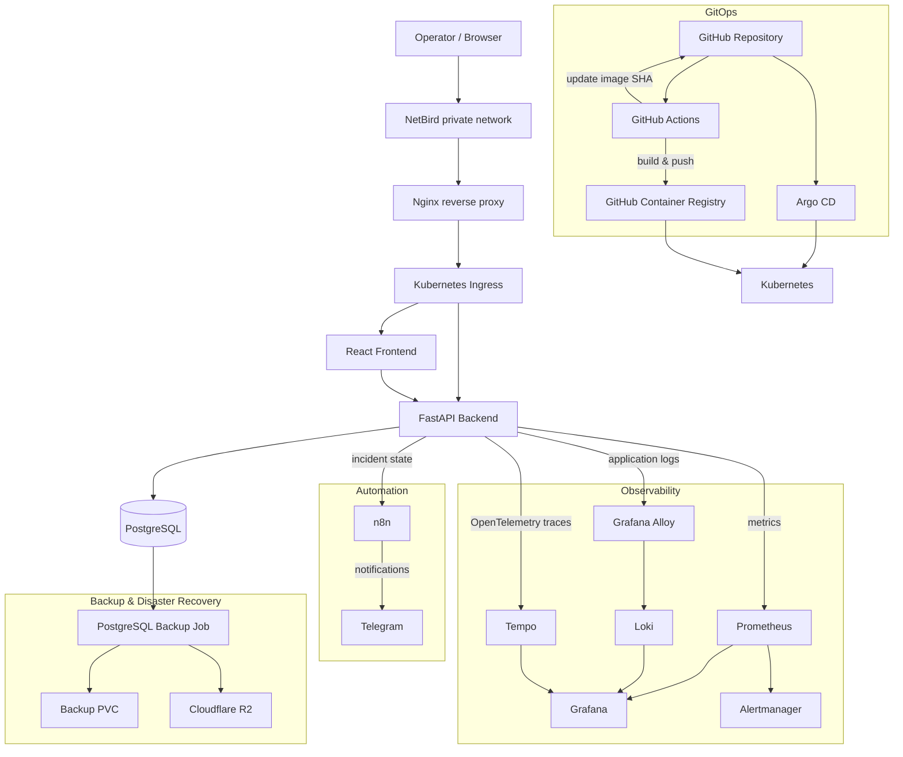

# Cloud Operations Center

> A cloud-native operations platform for service monitoring, incident management, observability, automation and disaster recovery.


**Cloud Operations Center** is a hands-on Cloud / DevOps / SRE project designed to reproduce the operational workflows used to run modern applications on Kubernetes.

It combines application development, GitOps, CI/CD, infrastructure automation, observability, service monitoring, incident management, notifications and disaster recovery in a single platform.

The goal is not only to deploy an application.

**The goal is to operate it.**

---

## Overview

Cloud Operations Center provides a web interface for monitoring services and managing incidents while running on a Kubernetes-based infrastructure with a complete observability and automation stack.

The platform includes:

* Service registration and health monitoring
* Automated service checks
* Incident creation and lifecycle management
* Operational dashboard
* Prometheus metrics
* Centralized logs with Loki
* Distributed tracing with OpenTelemetry and Tempo
* Grafana operational dashboards
* Prometheus / Alertmanager alerting
* Incident automation with n8n
* Telegram operational notifications
* GitOps deployment with Argo CD
* CI/CD with GitHub Actions
* Container images stored in GitHub Container Registry
* Immutable commit-based deployments
* Horizontal Pod Autoscaling
* PostgreSQL persistence
* Alembic database migrations
* Automated PostgreSQL backups
* Off-site backup replication to Cloudflare R2
* Tested database restoration and disaster recovery
* Secure remote access through NetBird

---

## Architecture



---

# Core Features

## Operational Dashboard

The React frontend provides a centralized view of the platform.

It displays:

* Total registered services
* Healthy services
* Unavailable services
* Open incidents
* Platform operational status
* Last refresh timestamp
* Environment information
* Application version
* Git build revision

The frontend periodically refreshes operational data from the FastAPI backend.

Operators can also manually refresh the current platform state.

---

## Service Monitoring

Services can be registered and monitored directly from the application.

The platform periodically evaluates registered endpoints and records their availability.

This provides the data required for:

* Current service status
* Availability history
* Service detail views
* Incident detection
* Operational dashboards
* Metrics
* Alerting

The automated service checker runs as a Kubernetes CronJob.

```text
Kubernetes CronJob
        ↓
Service Checker
        ↓
Cloud Operations Center API
        ↓
Registered Services
        ↓
Status + Check History
```

---

## Incident Management

Cloud Operations Center includes an incident lifecycle for operational events.

Incidents can transition through states such as:

```text
Open
  ↓
Investigating
  ↓
Resolved
```

This allows the platform to reproduce workflows commonly found in operations, infrastructure and SRE teams.

Incident information includes operational context such as:

* Incident status
* Related service
* Creation time
* Resolution information
* Investigation state

---

# Incident Automation — n8n & Telegram

Operational events are also processed through an **n8n automation workflow**.

n8n periodically retrieves incident information from the Cloud Operations Center API and detects relevant incident state transitions.

Depending on the incident lifecycle, notifications are sent to Telegram.

```text
Cloud Operations Center API
          ↓
         n8n
          ↓
 Detect incident changes
          ↓
 ┌────────┼──────────────┐
 Open  Investigating  Resolved
          ↓
       Telegram
          ↓
      Operator
```

The workflow keeps track of previously observed incident states so that notifications can be triggered when meaningful changes occur rather than sending the same alert continuously.

Typical notifications include:

* New active incidents
* Incidents under investigation
* Resolved incidents
* Relevant operational state changes

This automation complements the technical monitoring stack.

```text
Prometheus / Alertmanager
        ↓
Technical infrastructure alerts

Cloud Operations Center
        ↓
Incident lifecycle

n8n
        ↓
Workflow orchestration

Telegram
        ↓
Operator notification
```

This separation helps distinguish between **technical alert detection** and **incident lifecycle automation**.

---

# Observability

The observability platform is built around the three primary telemetry signals:

* Metrics
* Logs
* Traces

---

## Metrics — Prometheus

The FastAPI backend exposes Prometheus metrics for application and HTTP telemetry.

Examples include:

* Request count
* Request rate
* HTTP status codes
* Request latency
* Application process CPU
* Application process memory
* Business-level operational metrics

Prometheus also evaluates alerting rules and monitors platform components.

```text
FastAPI
   ↓
/metrics
   ↓
Prometheus
   ↓
Grafana
```

---

## Logs — Grafana Alloy + Loki

Application workloads write logs to stdout.

Grafana Alloy collects logs from Kubernetes and forwards them to Loki.

```text
FastAPI
   ↓
Structured application logs
   ↓
Kubernetes stdout
   ↓
Grafana Alloy
   ↓
Loki
   ↓
Grafana
```

Logs can then be explored alongside metrics and traces from Grafana.

---

## Distributed Tracing — OpenTelemetry + Tempo

The FastAPI backend is instrumented using OpenTelemetry.

```text
HTTP Request
    ↓
FastAPI
    ↓
OpenTelemetry
    ↓
Tempo
    ↓
Grafana
```

Trace identifiers are also included in application request logs.

This makes it possible to correlate:

```text
Request
   ↓
Trace ID
   ├── Application log
   └── Tempo trace
```

This provides a practical example of log and trace correlation.

---

## Grafana

Grafana provides operational dashboards for both application and infrastructure behavior.

Current dashboards include:

### Cloud Operations Center

Focused on platform-level health.

Examples:

* Backend availability
* PostgreSQL availability
* Pending Kubernetes pods
* Active alerts
* Backend replicas
* Container restarts
* CPU usage
* Memory usage
* Prometheus targets
* Open incidents

### Cloud Operations Center — Backend Observability

Focused on API behavior.

Examples:

* Backend operational state
* Total HTTP requests
* Requests per second
* Error percentage
* Average latency
* p95 latency
* Traffic per endpoint
* HTTP response status distribution
* Backend logs
* HTTP error logs

---

# Alerting

Prometheus evaluates technical alerting rules and forwards alerts to Alertmanager.

The alerting architecture separates monitoring from incident automation.

```text
Infrastructure / Application
            ↓
        Prometheus
            ↓
      Alertmanager
            ↓
     Technical Alert
```

At the application level:

```text
Service state / Incident state
            ↓
Cloud Operations Center
            ↓
           n8n
            ↓
        Telegram
```

This makes it possible to treat infrastructure alerts and operational incident notifications as different responsibilities.

---

# Kubernetes

The platform runs on Kubernetes and uses multiple namespaces to separate workloads.

## `cloud-ops`

Contains the primary application workloads:

* React frontend
* FastAPI backend
* PostgreSQL
* Service checker
* Database migration jobs
* PostgreSQL backup jobs

## `monitoring`

Contains the observability stack:

* Prometheus
* Grafana
* Loki
* Tempo
* Grafana Alloy
* Alertmanager

Additional infrastructure components are deployed and reconciled through Argo CD.

---

# Health Checks

Kubernetes readiness and liveness probes are configured for application workloads.

The backend exposes:

```text
/health
```

for Kubernetes health checking.

A more detailed endpoint provides component status and deployment metadata:

```text
/health/detailed
```

Example:

```json
{
  "status": "ok",
  "database": "up",
  "prometheus": "up",
  "tempo": "up",
  "version": "1.0.0",
  "build_sha": "<git-commit-sha>",
  "environment": "production"
}
```

This makes a deployed container directly traceable to the Git revision that produced it.

---

# GitOps with Argo CD

Argo CD continuously reconciles the desired state stored in Git with the Kubernetes cluster.

The project uses multiple Argo CD Applications to separate infrastructure responsibilities.

Examples include:

* Cloud Operations Center
* Monitoring stack
* Loki
* Grafana Alloy
* cert-manager

```text
Git Repository
      ↓
   Argo CD
      ↓
 Kubernetes
```

The primary applications use automated synchronization.

Where appropriate, pruning is enabled so resources removed from Git are also removed from the Kubernetes cluster.

Git therefore acts as the **source of truth** for the platform.

---

# CI/CD

GitHub Actions provides the continuous integration and delivery pipeline.

The pipeline validates application code before building and deploying containers.

## Pipeline

```text
Developer
   ↓
git push
   ↓
GitHub
   ↓
GitHub Actions
   │
   ├── Backend validation
   ├── Frontend lint
   └── Frontend production build
   ↓
Docker Buildx
   ↓
GitHub Container Registry
   ↓
GitOps manifest update
   ↓
Git commit
   ↓
Argo CD
   ↓
Kubernetes rollout
```

For each application change:

1. Backend Python syntax is validated.
2. Frontend dependencies are installed.
3. Frontend linting is executed.
4. The frontend production build is validated.
5. Backend and frontend Docker images are built.
6. Images are pushed to GitHub Container Registry.
7. Images receive immutable commit-based tags.
8. Kubernetes manifests are updated automatically.
9. A GitOps deployment commit is created.
10. Argo CD detects the new desired state.
11. Kubernetes performs the rollout.

---

## Immutable Image Versioning

Production deployments do not depend on `latest`.

Images are tagged using the Git commit:

```text
cloud-operations-backend:sha-3ebe19b
cloud-operations-frontend:sha-3ebe19b
```

This provides a direct relationship between:

```text
Git commit
   ↓
Container image
   ↓
Kubernetes deployment
```

and makes deployments reproducible and auditable.

---

# Release Metadata

Current release:

```text
Cloud Operations Center

Version:      1.0.0
Environment:  production
Build:        Git commit SHA
```

Version and build information are injected during the CI/CD build.

The backend exposes this information through its detailed health endpoint.

The frontend also displays the application version and short build revision.

Example:

```text
Acceso seguro · NetBird · v1.0.0 · 3ebe19b
```

---

# PostgreSQL & Persistence

PostgreSQL provides persistent application storage.

Kubernetes PersistentVolumeClaims are used so database data survives:

* Pod recreation
* Kubernetes rollouts
* Application deployments

The database stores information such as:

* Services
* Service checks
* Incidents
* Incident state

---

# Database Migrations

Database schema evolution is managed using **Alembic**.

Migration execution is integrated with Kubernetes.

The migration workflow waits for PostgreSQL readiness before attempting schema changes.

```text
Deployment
    ↓
PostgreSQL readiness
    ↓
Alembic migration job
    ↓
Database schema
```

This prevents migrations from executing before the database is available.

---

# Backup & Disaster Recovery

Database protection is implemented at multiple levels.

## Automated PostgreSQL Backups

A Kubernetes CronJob periodically creates PostgreSQL backups.

```text
PostgreSQL
    ↓
 pg_dump
    ↓
Backup Job
    ↓
Persistent backup storage
```

---

## Off-Site Replication — Cloudflare R2

Backups are additionally replicated outside the Kubernetes cluster using **Cloudflare R2**.

```text
PostgreSQL
      ↓
Backup CronJob
      ↓
 ┌────┴──────────────┐
 │                   │
Local Backup     Cloudflare R2
Storage          Off-site copy
```

This protects database backups from failures affecting only the local Kubernetes environment.

---

## Disaster Recovery Testing

Backup creation alone is not considered sufficient.

The project includes a tested recovery process.

A PostgreSQL backup has been restored into an isolated recovery environment and the restored database has been validated.

```text
Cloudflare R2
      ↓
Download backup
      ↓
Recovery PostgreSQL
      ↓
Restore
      ↓
Validate database
```

This verifies the complete recovery path rather than simply checking that backup files exist.

---

# Reliability

The platform includes several mechanisms intended to improve operational reliability.

* Kubernetes readiness probes
* Kubernetes liveness probes
* PostgreSQL persistent storage
* Horizontal Pod Autoscaling
* Automated service health checking
* GitOps reconciliation
* Immutable container image references
* Automated PostgreSQL backups
* Off-site backup replication
* Tested disaster recovery
* Metrics monitoring
* Centralized logging
* Distributed tracing
* Alerting
* Incident automation

---

# Security

Sensitive configuration is intentionally excluded from Git.

The repository ignores:

* `.env` files
* Kubernetes Secret manifests containing real credentials
* Telegram secret configuration
* Private keys
* Certificates
* Local backup archives
* Python virtual environments
* Build artifacts

Example Kubernetes Secret templates are committed instead of real credentials.

Real secrets are injected into Kubernetes independently from the Git repository.

Remote administrative access to the current environment is performed through a private NetBird network.

---

# Traffic Generator

The repository includes a synthetic traffic generator.

Its purpose is to continuously produce activity against the FastAPI backend.

```text
Traffic Generator
       ↓
FastAPI
       ↓
PostgreSQL
       ↓
Metrics / Logs / Traces
       ↓
Grafana
```

This provides realistic telemetry even when the platform does not have real external users.

Generated traffic feeds:

* Prometheus metrics
* Loki logs
* Tempo traces
* Grafana dashboards

This allows the observability platform to remain useful during demonstrations and development.

---

# Repository Structure

```text
cloud-operations-center/
│
├── backend/
│   ├── alembic/
│   ├── app/
│   ├── Dockerfile
│   └── requirements.txt
│
├── frontend/
│   ├── src/
│   ├── public/
│   ├── Dockerfile
│   └── nginx.conf
│
├── database/
│
├── docs/
│   ├── architecture.md
│   ├── product-definition.md
│   ├── api-design.md
│   ├── data-model.md
│   ├── alerting-responsibilities.md
│   └── backlog.md
│
├── infra/
│   └── nginx/
│
├── k8s/
│   ├── argocd/
│   ├── base/
│   │   ├── automation/
│   │   ├── backend/
│   │   ├── frontend/
│   │   ├── ingress/
│   │   ├── monitoring/
│   │   └── postgres/
│   │
│   └── monitoring/
│
├── n8n/
│   └── workflows/
│
├── observability/
│   ├── loki/
│   ├── prometheus/
│   └── tempo/
│
├── scripts/
│
├── traffic-generator/
│
├── .github/
│   └── workflows/
│       └── ci-cd.yml
│
├── docker-compose.yml
└── README.md
```

---

# Documentation

Additional technical documentation is available under [`docs/`](docs/).

Current documentation includes:

* Architecture
* Product definition
* API design
* Data model
* Alerting responsibilities
* Project backlog

---

# Technology Stack

## Application

* Python
* FastAPI
* React
* Vite
* PostgreSQL
* Alembic

## Containers & Orchestration

* Docker
* Kubernetes
* Kubernetes Ingress
* PersistentVolumeClaims
* Horizontal Pod Autoscaler
* Kubernetes CronJobs
* Kubernetes health probes

## DevOps & GitOps

* Git
* GitHub
* GitHub Actions
* GitHub Container Registry
* Argo CD

## Observability

* OpenTelemetry
* Prometheus
* Grafana
* Loki
* Tempo
* Grafana Alloy
* Alertmanager

## Automation

* n8n
* Telegram

## Backup & Disaster Recovery

* PostgreSQL `pg_dump`
* Kubernetes backup CronJobs
* Persistent backup storage
* Cloudflare R2

## Networking & Access

* Nginx
* Kubernetes Ingress
* HTTPS
* NetBird

---

# What This Project Demonstrates

Cloud Operations Center was designed as an end-to-end engineering project rather than as an isolated web application.

It demonstrates practical experience across several engineering areas.

## Application Engineering

* REST API development
* React frontend development
* Relational database design
* Database migrations
* Health endpoints
* Operational user interfaces

## Containers & Kubernetes

* Docker image creation
* Kubernetes Deployments
* Kubernetes Services
* Ingress routing
* Persistent storage
* Health probes
* CronJobs
* Horizontal Pod Autoscaling

## DevOps

* CI/CD pipelines
* Container registries
* Automated deployments
* Git-based workflows
* Immutable artifact versioning

## GitOps

* Argo CD
* Declarative Kubernetes configuration
* Automated synchronization
* Automated pruning
* Git as infrastructure source of truth

## Observability

* Metrics
* Logs
* Distributed tracing
* Operational dashboards
* Alerting
* Trace/log correlation

## Operations

* Service monitoring
* Incident management
* Health checking
* Incident lifecycle automation
* Telegram notifications
* Technical alerting
* Backup automation
* Disaster recovery testing

---

# Operational Flow

A simplified example of how the different components work together:

```text
User request
     ↓
Frontend
     ↓
FastAPI
     ↓
PostgreSQL

Meanwhile:

FastAPI
 ├── metrics ──────→ Prometheus
 ├── traces ───────→ Tempo
 └── logs ─────────→ Alloy → Loki

Prometheus
     ↓
Alertmanager

Operational incident
     ↓
Cloud Operations Center
     ↓
n8n
     ↓
Telegram
     ↓
Operator

Code change
     ↓
GitHub
     ↓
GitHub Actions
     ↓
GHCR
     ↓
GitOps commit
     ↓
Argo CD
     ↓
Kubernetes
```

---

# Project Status

**Version:** `1.0.0`

Core platform functionality is operational.

Current development focuses on:

* Product polish
* Portfolio presentation
* User experience improvements
* Documentation
* Demonstration material
* Screenshots and architecture visuals

---

# Planned Portfolio Improvements

The technical foundation of the platform is complete enough to focus on presentation and usability.

Planned improvements include:

* Improved frontend visual polish
* Dedicated System / About view
* Architecture screenshots and diagrams
* Grafana screenshots
* Argo CD deployment screenshots
* CI/CD screenshots
* Release changelog
* GitHub `v1.0.0` release
* Demo-ready operational scenarios

---

# Author

**David C.H**

Cloud / DevOps / Systems Administration portfolio project.
