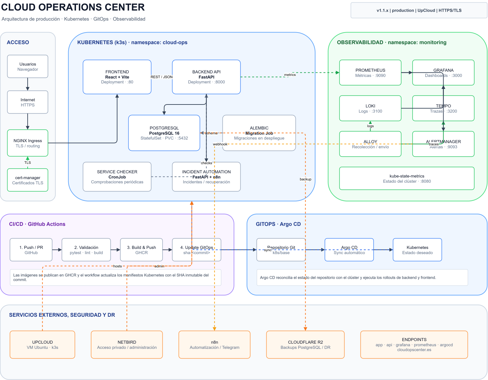

# Architecture

Cloud Operations Center is deployed as a containerized, GitOps-managed platform
running on Kubernetes.

The platform combines application workloads, automated deployments,
observability, incident management, and disaster recovery.


## Architecture Diagram

<p align="center">
  
</p>

The editable draw.io source, when available, is stored under:

[`docs/architecture/`](architecture/)

---

## Production Architecture

```text
                         GitHub
                            │
                            ▼
                    GitHub Actions
                            │
             ┌──────────────┴──────────────┐
             ▼                             ▼
       Backend Image                 Frontend Image
             │                             │
             └──────────► GHCR ◄───────────┘
                            │
                            ▼
                    GitOps Manifests
                            │
                            ▼
                         Argo CD
                            │
                            ▼
                     Kubernetes / k3s
                            │
          ┌─────────────────┼─────────────────┐
          │                 │                 │
          ▼                 ▼                 ▼
      Frontend          Backend API       PostgreSQL
      React/Vite         FastAPI          PostgreSQL 16
          │                 │
          └────────┬────────┘
                   │
                   ▼
             Observability
                   │
       ┌───────────┼────────────┐
       ▼           ▼            ▼
 Prometheus       Loki         Tempo
   Metrics        Logs         Traces
       │           │            │
       └───────────┼────────────┘
                   ▼
                 Grafana

Prometheus ─────► Alertmanager ─────► n8n / Telegram

PostgreSQL ─────► Automated Backups ─────► Cloudflare R2


## Kubernetes

The application runs on Kubernetes using k3s.

Application workloads are deployed in the `cloud-ops` namespace.

The main workloads are:

- Frontend
- Backend API
- PostgreSQL
- Service Checker
- Database migration jobs

Monitoring and observability workloads run primarily in the `monitoring` namespace.

---

## Frontend

The frontend is built with React and Vite.

It provides the user interface for:

- System overview
- Service monitoring
- Incident management
- Service availability
- Platform health
- Operational information

The frontend is deployed as a Kubernetes `Deployment`.

---

## Backend API

The backend is implemented with FastAPI and Python.

It is responsible for:

- Business logic
- Authentication
- Service management
- Incident management
- Automated service checks
- Health endpoints
- PostgreSQL access
- Metrics and distributed tracing integration

The API is deployed as a Kubernetes `Deployment`.

---

## PostgreSQL

PostgreSQL 16 provides persistent storage for the platform.

It stores:

- Users
- Services
- Service checks
- Incidents
- Alembic migration state

Persistent storage is provided through a Kubernetes `PersistentVolumeClaim`.

Database schema migrations are managed with Alembic and executed as part of the deployment process.

---

## Service Checker

A Kubernetes `CronJob` periodically checks the availability of configured services.

The Service Checker records service availability data and can automatically create incidents when a service becomes unavailable.

When the affected service recovers, the platform can automatically resolve the corresponding incident.

---

## Observability

Cloud Operations Center includes a complete observability stack for metrics, logs, traces, alerts, and Kubernetes workload visibility.

### Prometheus

Prometheus collects application and Kubernetes metrics.

It is also used to evaluate alerting rules and monitor platform health.

### Grafana

Grafana provides dashboards and visualization for:

- Metrics
- Logs
- Distributed traces
- Kubernetes resources
- Application performance

### Loki

Loki centralizes application and infrastructure logs.

Logs can be explored and correlated with metrics and traces from Grafana.

### Tempo

Tempo stores distributed traces generated through OpenTelemetry.

It allows requests to be followed across the backend and other instrumented components.

### Alloy

Grafana Alloy collects and forwards telemetry data across the observability stack.

### kube-state-metrics

`kube-state-metrics` exposes Kubernetes object and workload metrics to Prometheus.

This provides visibility into deployments, pods, jobs, replicas, and other Kubernetes resources.

### Alertmanager

Alertmanager processes alerts generated by Prometheus.

Operational alerts can be forwarded to automation workflows and external notification systems.

---

## OpenTelemetry

The backend is instrumented with OpenTelemetry.

Distributed traces are exported to Tempo and can be correlated with application metrics and logs through Grafana.

This provides end-to-end visibility into application requests and backend operations.

---

## Incident Automation

Operational alerts can be forwarded from Alertmanager to n8n.

n8n handles automation workflows and Telegram notifications for relevant incidents and infrastructure events.

The platform also supports automated incident creation and resolution based on service availability checks.

---

## CI/CD

GitHub Actions provides the CI/CD pipeline for Cloud Operations Center.

For each relevant change, the pipeline performs:

1. Backend validation and `pytest` tests.
2. Frontend linting and production build.
3. Docker image builds.
4. Image publication to GitHub Container Registry (GHCR).
5. GitOps manifest updates using immutable commit-based image tags.

Pull requests execute validation jobs without deploying production images.

Production deployments are triggered after changes are merged into the main branch.

---

## GitOps

Argo CD manages Kubernetes deployments using GitOps principles.

The deployment flow is:

```text
GitHub
   │
   ▼
GitHub Actions
   │
   ▼
Build & Push Docker Images
   │
   ▼
GitHub Container Registry
   │
   ▼
Update Kubernetes Manifests
   │
   ▼
Git Repository
   │
   ▼
Argo CD
   │
   ▼
Kubernetes
```

GitHub Actions updates the Kubernetes manifests with immutable image tags based on the Git commit SHA.

Argo CD continuously reconciles the desired state stored in Git with the running Kubernetes cluster.

This provides a fully declarative and reproducible deployment process.

---

## Networking and TLS

External traffic reaches the platform through NGINX Ingress.

HTTPS certificates are automatically issued and managed using cert-manager.

Production endpoints include:

- `https://app.cloudopscenter.es`
- `https://api.cloudopscenter.es`
- `https://grafana.cloudopscenter.es`
- `https://prometheus.cloudopscenter.es`
- `https://argocd.cloudopscenter.es`

All exposed production services use HTTPS.

---

## Platform Health

The backend exposes a detailed health endpoint:

```text
/api/health/detailed
```

The endpoint verifies the operational state of:

- PostgreSQL
- Prometheus
- Tempo

It also exposes application metadata such as:

- Application version
- Build SHA
- Environment
- Current timestamp

The frontend **System** page displays this information and provides a centralized view of platform health.

---

## Backup and Disaster Recovery

PostgreSQL backups are executed automatically using a Kubernetes `CronJob`.

The backup process:

1. Creates a PostgreSQL custom-format dump.
2. Validates the generated dump.
3. Stores a local backup.
4. Uploads the backup to Cloudflare R2.
5. Verifies that the remote object exists.

Local backups are retained for a limited period, while remote copies provide off-site disaster recovery protection.

The disaster recovery procedure has been successfully tested by restoring a backup downloaded from Cloudflare R2 into an isolated PostgreSQL instance.

The restored database was validated by checking the main application tables and stored records.

This confirms that the backup and recovery process works end-to-end without affecting the production database.

---

## Secure Administration

NetBird is used for secure private administrative access to selected platform services and infrastructure.

It provides an additional private networking layer for management operations without exposing internal services directly to the public Internet.

---

## Main Technologies

| Area | Technology |
|---|---|
| Frontend | React + Vite |
| Backend | FastAPI / Python |
| Database | PostgreSQL 16 |
| Containers | Docker |
| Orchestration | Kubernetes / k3s |
| GitOps | Argo CD |
| CI/CD | GitHub Actions |
| Container Registry | GitHub Container Registry (GHCR) |
| Metrics | Prometheus |
| Dashboards | Grafana |
| Logs | Loki |
| Tracing | OpenTelemetry + Tempo |
| Telemetry Collection | Grafana Alloy |
| Kubernetes Metrics | kube-state-metrics |
| Alerts | Alertmanager |
| Automation | n8n |
| Notifications | Telegram |
| TLS | cert-manager |
| Ingress | NGINX Ingress |
| Backups | PostgreSQL + Cloudflare R2 |
| Private Access | NetBird |

